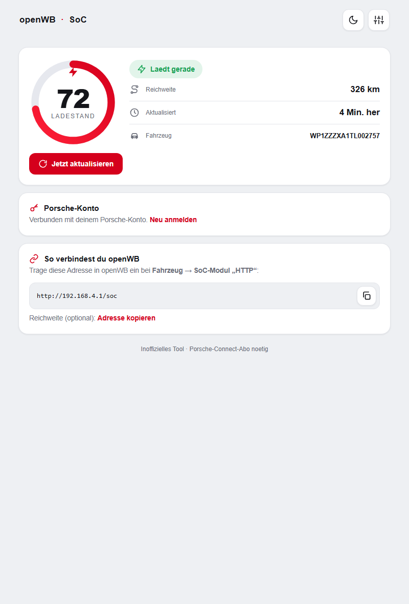
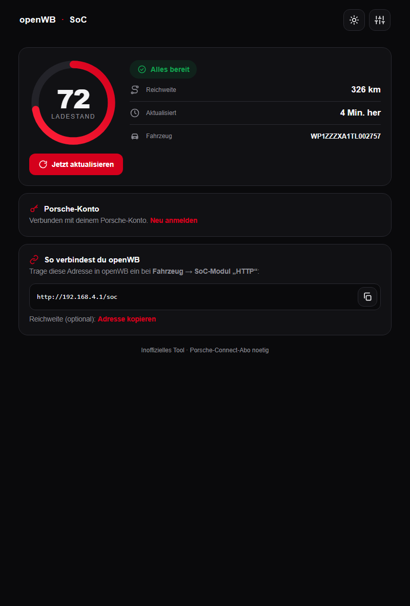
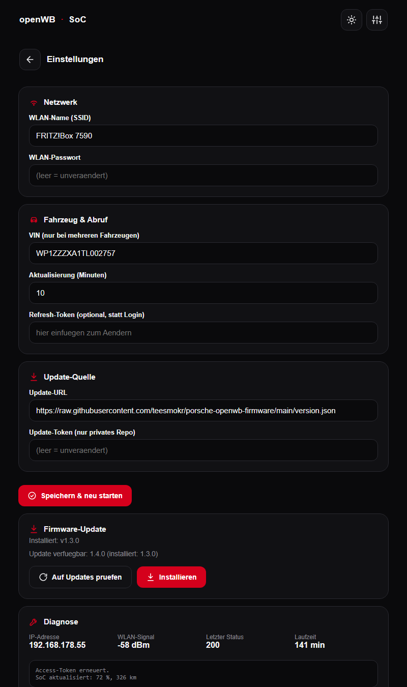
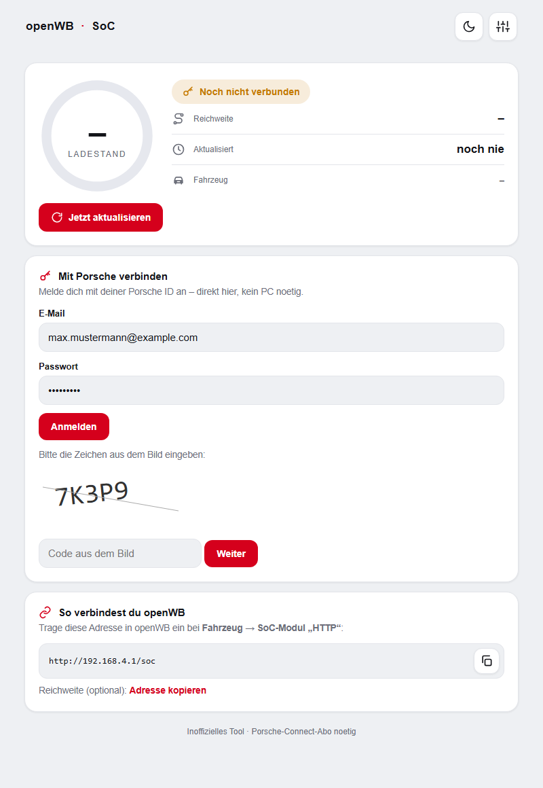

# Porsche → openWB SoC-Anbindung

Liest den Ladestand (SoC), die Reichweite und den Kilometerstand eines **Porsche
mit Porsche Connect** (z. B. Macan EV ab 2024, Taycan, Cayenne E3, Panamera G2,
911 ab 992, 718) und stellt ihn **openWB** zur Verfügung — u. a. fürs
PV-Überschussladen bis zu einem Ziel-SoC.

> Inoffiziell: Die Porsche-Connect-Schnittstelle ist nicht von Porsche
> freigegeben und kann sich ändern. Ein aktives Porsche-Connect-Abo ist nötig.
> Login-Flow/Endpunkte sind portiert aus
> [pyporscheconnectapi](https://github.com/CJNE/pyporscheconnectapi) (Apache-2.0).

## Screenshots (ESP32-Web-Interface)

Aufgeräumtes Dashboard mit **Hell-/Dunkel-Modus**, Piktogrammen und
freundlicher Sprache. Alle technischen Einstellungen liegen im **Admin-Bereich**
(Zahnrad).

| Dashboard (hell) | Dashboard (dunkel) |
|---|---|
|  |  |

| Admin / Einstellungen | Anmeldung mit Captcha |
|---|---|
|  |  |

- **Dashboard:** Lade-Ring mit Ladeanzeige, Status-Pille, Reichweite/Zeit/Auto,
  „So verbindest du openWB" mit Kopier-Button.
- **Admin:** Netzwerk, Fahrzeug & Abruf, Update-Quelle, Firmware-Update, Diagnose.
- **Anmeldung:** Porsche-Login inkl. **Captcha** direkt im Browser.

## Was ist enthalten

| Ordner | Inhalt |
|---|---|
| [`firmware-esp32/`](firmware-esp32/) | **Dedizierte ESP32-Bridge** mit Web-Interface (Setup + Live-Status + Diagnose). Läuft dauerhaft, kein PC nötig. Empfohlen für den festen Einbau. |
| [`pc-tool/`](pc-tool/) | Windows-Tool (Python/Tkinter): Porsche-Login testen, **Refresh-Token** erzeugen, SoC-Bridge auf dem PC, optionaler SSH-Installer. |
| [`openwb-module/`](openwb-module/) | Natives openWB-Fahrzeug-SoC-Modul `porsche` (falls SSH-Zugang zur openWB besteht). |
| [`docs/`](docs/) | Deployment-Anleitung (Pi) und PR-Beschreibung. |

## Welcher Weg?

Der Porsche-Voll-Login braucht ein **Captcha** — das löst man **einmalig am PC**
(pc-tool → Tab 1). Dabei entsteht ein **Refresh-Token**, mit dem sich alles
Weitere ohne Captcha erneuert. Danach:

- **ESP32-Bridge (empfohlen):** Anmeldung **direkt im Web-Interface** des ESP32
  (E-Mail/Passwort, Captcha wird angezeigt) — oder alternativ den am PC erzeugten
  Refresh-Token eintragen. Der ESP32 holt den SoC dauerhaft und stellt ihn per
  HTTP bereit; in openWB das SoC-Modul **HTTP** auf `http://<esp-ip>/soc` zeigen.
  Enthält einen **Online-Updater (OTA)** — die Firmware wird tokenlos über das
  öffentliche Repo
  [`teesmokr/porsche-openwb-firmware`](https://github.com/teesmokr/porsche-openwb-firmware)
  ausgeliefert (Standard-URL ist ab Werk eingetragen).
  → siehe [firmware-esp32/README.md](firmware-esp32/README.md) und
  [firmware-bin/README.md](firmware-bin/README.md)
- **PC-Bridge (ohne SSH, ohne Extra-Hardware):** pc-tool → Tab 2 startet einen
  lokalen HTTP-Dienst; openWB-HTTP-Modul zeigt darauf. PC muss laufen.
- **Natives Modul (nur mit SSH-Zugang zur openWB):** Modul aus `openwb-module/`
  auf die openWB kopieren → siehe [docs/PI_DEPLOY.md](docs/PI_DEPLOY.md).

## Ablauf in Kürze

1. `pc-tool` bauen/starten, **Tab 1**: bei Porsche einloggen (Captcha lösen),
   **„Refresh-Token kopieren"**.
2. Bridge einrichten (ESP32 **oder** PC).
3. In openWB: Fahrzeug → SoC-Modul **HTTP** → `http://<bridge>/soc` (und
   optional `/range`).

## Lizenz / Herkunft

Enthält aus Apache-2.0-Code (pyporscheconnectapi) portierte Teile; das
openWB-Modul zielt auf das GPLv3-Projekt [openWB/core](https://github.com/openWB/core).
Private Nutzung. Zugangsdaten/Tokens gehören **nicht** ins Repository.
